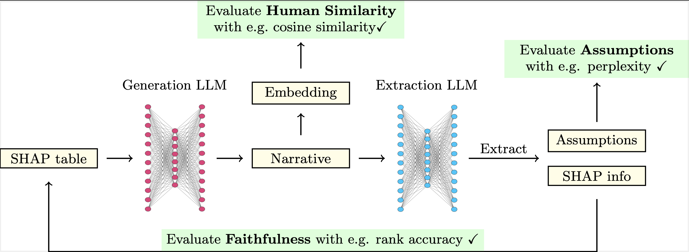

## SHAPnarrative-metrics

In this repository we explore several automated metrics for XAI narratives based on SHAP. 

This is a research-level repository shared for reproducibility purposes accompanying our recent paper: [https://arxiv.org/abs/2412.10220](https://arxiv.org/abs/2412.10220)

A framework for XAI narratives and their metrics will be made available soon. [link to follow].


Birdseye overview of the workflow (from paper)



## Setup
Clone repository:

```python
git clone git@github.com:ADMAntwerp/SHAPnarrative-metrics.git
````

Create venv and activate:
 
```python
python -m venv venv
source venv/bin/activate
```

The main code is written as a package (although only meant for this research paper). Install the package in editable mode (required step for paths to work):

```python
pip install -e .
```

## Config keys

Create a `config/keys.yaml` file with API keys for: OpenAI, Anthropic, Replicate (used for Llama-3 70b), and Mistral. Also include a HuggingFace token with access to Llama-3 8b, and Mistral-7b. 

## Data prep

All data prep happens inside the notebooks inside `data/`, and the results are saved in the respective directories.

We did not aim to attain an optimal performance for the target model and hence the preprocessing is pretty basic. 

## General overview

### Main code:
`shapnarrative_metrics` Written as a package -- it contains central parts of the code:

`llm_tools` Everything to make the generation and extraction models work

`experiment_management` Managing experiments with many combinations of models/prompt_types/datasets etc.

`metrics` Functions to compute narrative metrics and add them to the experiment classes

### Scripts:

`experiments`: Contains modules to actually run the code from shapnarrative_metrics and generate the narratives and compute metrics. 

`figmakers`: (figures used in a broad sense) Generate either figures directly or data used in specific figures in the paper.

### Other directories:

`data`: Contains data preprocessing code and some other external data files such as human written narratives of manually manipulated assumptions

`results`: All results from actually executing the modules in scripts will go here

## Running experiments and computing metrics

### Step 1 Generating narratives:

Get familiar with scripts/experiments/run_experiments.py and the various parameters and path management there. See how multiple paths correspond to multiple identical iterations of the same experiment (this is the noise-averaging discussed in the paper).

Then run the following (doing all of this runs up quite some API calls so beware of costs) 

1) Run 1 experiment with both short and long prompt      combinations 

2) Run 4 experiments with only long prompt types but MANIP=0

3) Run 4 experiments with only long prompt types but MANIP=1

4) Run 1 experiment with MANIP=1, but use the special shap_permutation manipulation function

Make sure to manage the paths to save the results in the appropriate results folder

### Step 2 Computing Metrics (local):

The computation of the metrics is performed in two steps:

1. `python -m scripts.experiments.compute_metrics_local`: computes everything that can be run on any laptop

2.  `python -m scripts.experiments.compute_metrics_cloud`: computes everything that requires some heavier RAM (loading llama and mistral smaller models) 

Please make sure to manage the paths appropriately when running these for every experiment class performed above. 

## Reproducing Specific Figures or Tables

After all the previous steps are done, the figures or data for the figures is generated using:

### Figures:

**Figure 4:** (heatmap rank, sign and value differences)

`python -m scripts.figmakers.heatmap_ranksign
`

**Figure 5:** (Perplexity difference plot)

Run with HF token (will use Llama 8 b locally, so perhaps cloud):

`python -m scripts.figmakers.manipulated_assumptions_ppl
`
This will generate a csv file that is used for the figure in the paper

**Figure 6:** (Bleurt and Cosine similarity plots)

The BLEURT data is generated using:

`python -m scripts.figmakers.bleurt_scatter_fig
`

The cosine similarity data together with the counting of the closest matches is performed in:

`notebooks/metrics_validation/humansim_plot_data.ipynb
`

**Figure 8:** (Manipulated sign swaps bar plots)

These figures were generated as part of an exploration performed in `notebooks/swapcounts_figure.ipynb`

The data for the figures is saved as csv's in `results/figures/` and then used in the paper

### Tables:

The CSV files for all tables are created by running `python -m scripts.figmakers.tables` 

**Table 3:** The longshort table is directly the csv file found in g `results/figures/tables/longshort/`

**Table 4:** The main table is a combination of the data found in `results/figures/main/longshort/`


**Table 5-6-7:** These tables are  a combination of the data found in `results/figures/main/individual/`
